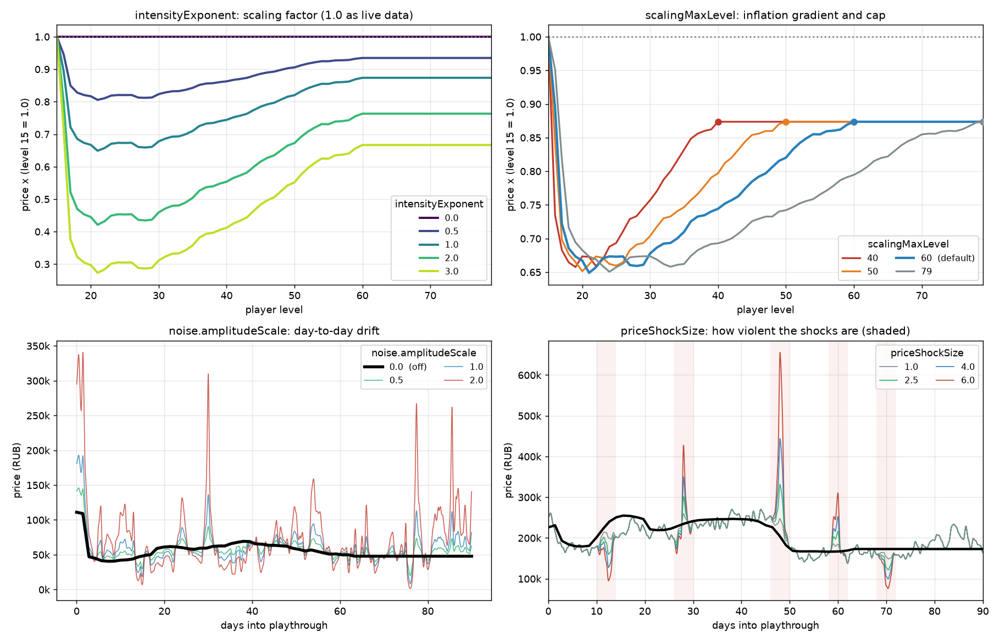

# Flea Price Level Scaling

**Flea market prices change as you level up**

We map seasonal flea prices to player level: At level 15 you are seeing flea prices as in the beginning of a wipe, at Level 79 you see flea prices as in the end of a wipe.


## What it actually feels like

The prices we used to model this come from **948 real snapshots** of the live flea market, taken every six hours across the entire EFT 1.0 season (15 November 2025 to 2 August 2026).

For a typical item, the arc looks like this:

| Your level | 15 | 20 | 21 | 40 | 60 | 79 |
|---|---|---|---|---|---|---|
| Price | 100% | 67% | **65%** | 74% | 87% | 87% |

Expensive when everything is sparse at the begining, bottoming out around level 21, then inflation up to level 60.

The whole season plays out between level 15 and level **60**, not 79. The real
season only lasted 250 days, and in that time live players got to roughly level
50-70 - so there is simply no real market data for what a level-79 economy looks
like, and this mod will not invent any. Past level 60 prices stop trending and
just keep drifting day to day. You can move that line with `scalingMaxLevel`.

That's just the average, though. Individual items might behave differently. Here some examples:

| Item | Level 15 | Level 79 | |
|---|---|---|---|
| **Respirator** | ₽8,800 | ₽49,200 | x5.6 - strong inflation |
| **Geiger counter** | ₽27,400 | ₽89,400 | x3.3 - medium inflation |
| **Gunpowder "Kite"** | ₽18,700 | ₽18,700 | x1.0 - doesn't seem to move in live data |
| **Colt M4A1** | ₽111,000 | ₽47,900 | x0.43 - deflation for common items (inflation of item availablility) |
| **Gas station key** | ₽755,000 | ₽20,300 | x0.03 - extreme deflation; not sure why, maybe someone with live experience knows why...? |

We also implemented prices **drift from day to day**, idependent from leveling. We see spikes and drops of item prices depending on current supply and demand.
For this mod we use a pseudo-random approach for this. Seed is calculated from profileId+RegistrationDate, every run will see different noise in market movement.


*Two characters' playthrough have a different movement of the market for the same underlying trend (black).*

## Installation

1. Download the release.
2. Extract the zip into your SPT root (it already contains `SPT_Runtime/user/mods/FleaPriceLevelScaling/`).
3. Start the server.

## Configuration

Use `config.jsonc`. We provide some insight to the parameters below

### Player settings

Most interesting settings for customization

| Setting | Default | Valid range | What it does |
|---|---|---|---|
| `enabled` | `true` | - | Turn the mod off without uninstalling it. |
| `intensityExponent` | `1.0` | `0.0` - `10.0` | How hard prices react to your level. `0` = no scaling at all. `1` = as real economy. `2` = increased swing. |
| `scalingMaxLevel` | `60` | - | The level where the season runs out. Above it prices stop trending and only drift. `79` = stretch the season over every level, `40` = a fast, compressed economy. |
| `priceShockSize` | `4.0` | `1.0` - `20.0` | How violent occasional price spikes are. `1` = no shocks, just gentle drift. `4` = as seen in real flea data. |
| `noise.enabled` | `true` | - | Whether prices drift day to day at all. `false` = perfectly smooth, prices only move when you level and follow the filtered median. |
| `noise.amplitudeScale` | `1.0` | `0.0` - `10.0` | How big that daily drift is. `0` = off, `1` = as seen in real flea data, `2` = more chaotic. |



Some tuning indicators:
- **If a few prices occasionally look absurd** (a spike out of nowhere), drop `priceShockSize` to `2.5` or `1.0`. The everyday drift is left alone.
- **If prices never sit still**, drop `noise.amplitudeScale` to `0.5`. That halves all movement, spikes included.
- **If you reach level 60 far too quickly**, raise `scalingMaxLevel` so the season is spread over more levels.
- **If you want a 100% calm and predictable economy**, set `noise.enabled` to `false`. You keep the level-based trend without the random walk.

### Debug settings

Likely not needed.

| Setting | Default | Valid range | What it does |
|---|---|---|---|
| `startDay` | `10.0` | - | Which day of the real season your flea unlock maps to. This mainly could be used to avoid the initial expensive phase and later dip. `10` = early wipe, so you will see some items very expensive when unlocking the flea than a crash *and* finally the inflation phase. Set to `79` to skip this initial expensive phase and directly go for steady inflation. |
| `endDay` | `249.0` | - | Which day level 79 maps to. 249 is the last day with real data. Probably better not touch |
| `perPlaythrough` | `true` | - | `false` uses fixed seed and thereby disables per player ID randomness. |
| `priceBounds.min` | `0.2` | `0.001` - `1.0` | Hard floor on any price, as a multiple of SPT's default. |
| `priceBounds.max` | `5.0` | `1.0` - `1000.0` | Hard ceiling on any price, as a multiple of SPT's default. |
| `sigmaCap` | `0.5` | `0.0` - `5.0` | Ceiling on how wildly items is allowed to drift. |
| `jumpProbability` | `0.04` | `0.0` - `1.0` | How often price shocks happen (4% of two-day windows). |
| `fleaUnlockLevel` | `15` | - | Change only if another mod moves the flea unlock. |
| `itemBlacklist` | `[]` | - | Template IDs to leave at SPT's default price. |

## Known quirks

- **Some prices look odd sometimes.** These are price shocks we see in real flea data. Set priceShockSize = `1` if you don't like that. Or disable noise completely by noise.enabled = `false`.
- **Prices move even when you're not playing.** We model a drift that follows real time.
- **Early-wipe prices on some items (probably rare keys and quest items) are enormous.** Change startDay in the debug settings to a later day e.g. `79` if you don't like that.

## Is it safe to add to an existing profile?

Yes, profile is not touched.

## Credits and details

Price data comes from [DrakiaXYZ/SPT-LiveFleaPriceDB](https://github.com/DrakiaXYZ/SPT-LiveFleaPriceDB), the same source the excellent [SPT-LiveFleaPrices](https://github.com/DrakiaXYZ/SPT-LiveFleaPrices-CSharp) mod uses. Our mod takes a different angle on it: We prefer the flea to adapt to our character level to simulate a season. Its MIT license is reproduced in [THIRD_PARTY_NOTICES.md](THIRD_PARTY_NOTICES.md), since `live-data/` ships a copy of its snapshots.

This mod itself is [MIT licensed](LICENSE).

## Repository layout

| Folder | Contents |
|---|---|
| `live-data/` | The raw data basis for the 1.0 season (15 November 2025 to 2 August 2026), committed to the repo. |
| `analysis/` | Analysis of the raw data and pipeline to turn the snapshots into the price table. Results in `analysis/out/`. |
| `src/` | The mod and the derived table used by it. |
| `tests/` | Golden-vector and smoke tests for the C#. |
| `docs/` | Technical documentation and figures. `docs/forge/` holds the sp-mod.com listing copy. |

## Development

### Prerequisites

| For | Need |
|---|---|
| Building the mod | .NET 10 SDK |
| Running the analysis | Python 3.11+, `numpy pandas matplotlib` |
| Fetching a different time range/season | [`gh`](https://cli.github.com/) |

### Build

```bash
cd src/FleaPriceLevelScaling
dotnet build -c Release
```

Output is `bin/Release/FleaPriceLevelScaling/` containing three files:
- DLL
- `config.jsonc`
- `data/price_curves.json`

### Package a release

```bash
cd src/FleaPriceLevelScaling
./package.sh
```

Builds Release and writes `Package/FleaPriceLevelScaling-<version>.zip`, laid out as
`SPT_Runtime/user/mods/FleaPriceLevelScaling/...` so it can be extracted straight onto an SPT
install - the same convention DrakiaXYZ's SPT mods use.

### Test

```bash
cd tests/NoiseVectorTest
dotnet run
```

### The golden-vector contract

**If you change `analysis/fleanoise.py` or the shape of the price table, the committed vectors are stale and the C# is silently wrong.** Regenerate them, then re-verify:

```bash
python analysis/09_build_noise_model.py      # rewrites src/data/noise_test_vectors.json
cd tests/NoiseVectorTest && dotnet run # must still pass
```

**Treat `src/data/price_curves.json` as a build artefact. Never hand-edit it; regenerate it.**

### Regenerating the price table

The snapshots in `live-data/` are committed, so this works straight from a fresh clone:

```bash
cd analysis
python 02_build_matrix.py
python 07_build_trend_curves.py   # -> src/data/price_curves.json
python 09_build_noise_model.py    # adds noiseSigma + noise params, rewrites test vectors
```

- Stages 03-06 are the exploratory analysis; no need to run
- Stages 10-13 regenerate the figures; no need to run
- `01_fetch.py` (~114 MB, skips what is already on disk) is only needed if you deliberately want to pull a different time range or season from the live data scraper - not for a normal regenerate

`flealib.py` paths, season constants and the level<->day mapping.
