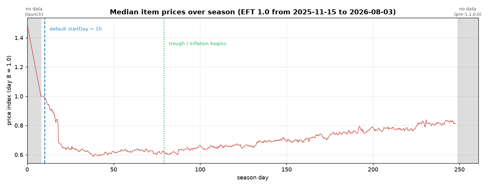
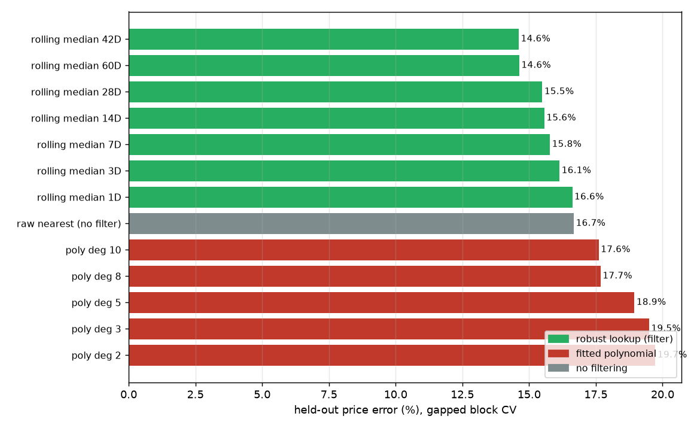
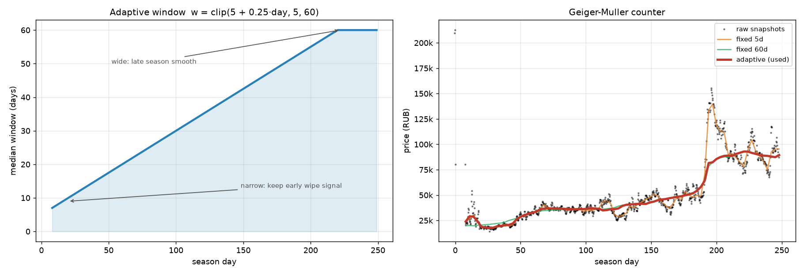
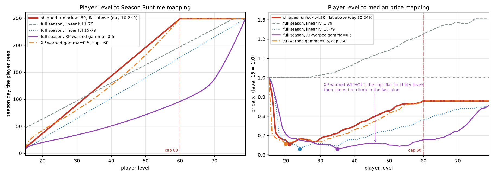
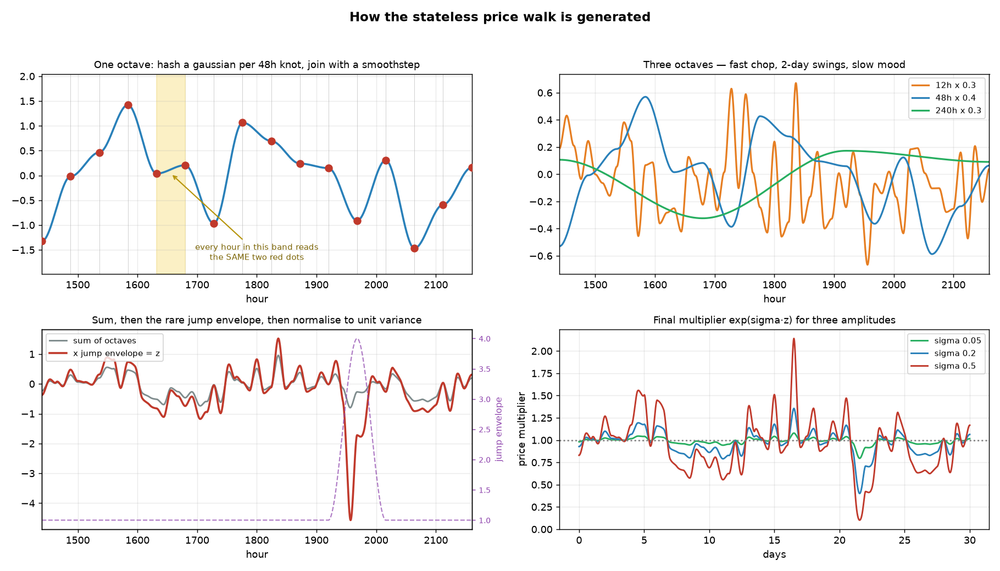
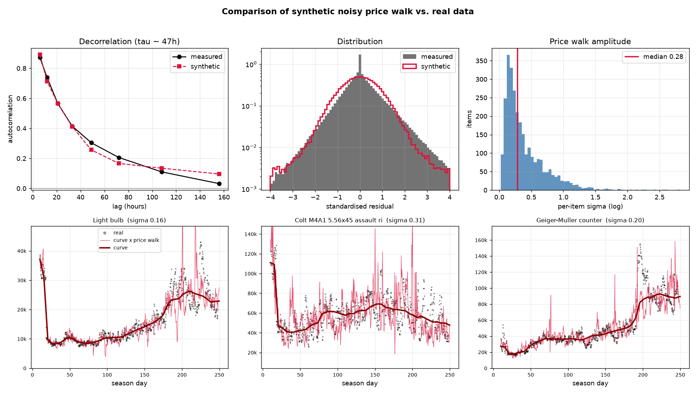
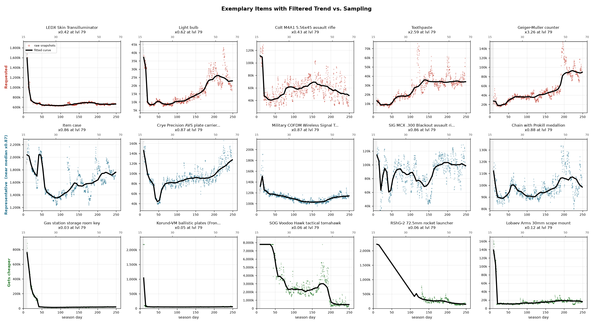
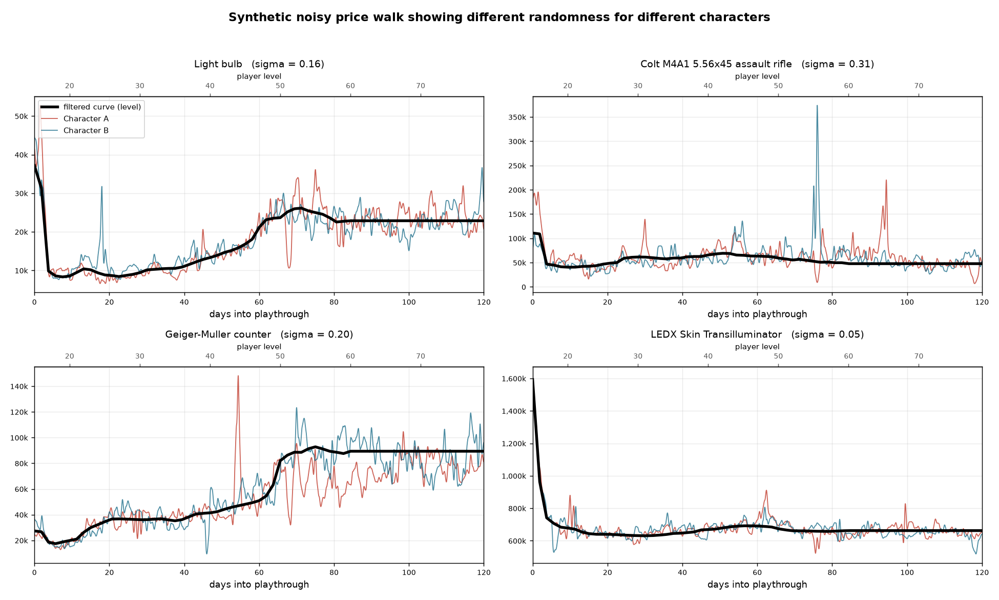

# Technical documentation

We take a full season of real flea market data EFT 1.0 season (15 November 2025 to 2 August 2026) to learn how prices behave over time.
To simulate that behavior for SPT, we analyze the general trend over time and the daily fluctuations.

The basis of this mod is the combination of 
- the general trend per item: Live season runtime mapped to SPT character level
- fluctuations learned per item: How prices vary around the trend with price shocks and random drift.

## 1. The problem

In live, flea-market prices move over a wipe. Right after a wipe everything is scarce and expensive; the market floods and prices crash; then, as players accumulate wealth, prices inflate again for the rest of the season. Also, there's general fluctuation based on momentary supply and demand.

## 2. The data

[DrakiaXYZ/SPT-LiveFleaPriceDB](https://github.com/DrakiaXYZ/SPT-LiveFleaPriceDB) scrapes tarkov.dev roughly every six hours and commits the result. Each commit is a snapshot: a flat JSON map of `templateId -> price in roubles`. Git history therefore *is* a price time series, we can use for our analysis.

We take the **EFT 1.0 season**: launch on 2025-11-15 (a full wipe) to the day before patch 1.1.0.0 / Season 1 "Kord Breach" on 2026-08-03.
This data consists of **948 snapshots**, median spacing 5.7 hours, covering 3,549 distinct items.



Note the two grey bands, there is some missing data:

| Gap | Season days |
|---|---|
| 2025-11-16 -> 11-22 | 8 -> 22 |
| 2026-07-22 -> 08-02 | 249 -> 260 |

Everything downstream is therefore restricted to **season days 8 -> 249**.
The valley after the initial wipe price crash will be denoted as **trough** in the remainder of the document.

### 2.1 Not all items provide meaningful data

Not every snapshot includes data for all items: Identify *staleness* (the fraction of consecutive snapshots where an item's price is identical) and *coverage* (the fraction of snapshots where the item is logged):

| Class | Count | Definition | Meaning |
|---|---|---|---|
| **core** | 2,849 | traded, updates regularly | will be modelled |
| **static** | 410 | staleness > 95% | price doesn't move  |
| **sparse** | 290 | coverage < 25% | listed too rarely to estimate anything meaningful |

**static** and **sparse** items will fall back to SPT default prices.

### 2.2 Floor-price artefacts

Some low value items sit at a minimum price in the live data for weeks, very often exactly ₽1:

| item | season median | min | longest episode |
|---|---|---|---|
| MP-155 walnut forestock | ₽1,800 | ₽1 | 30 days |
| 9x18mm PM PPT gzh ammo pack | ₽6,128 | ₽1 | 29 days |
| HK UMP bottom handguard rail | ₽10,000 | ₽14 | 30 days |

A walnut forestock did not trade at one rouble for a month: there's no demand for some items at all. We decided that we do not want to have these artefacts included.
An observation is treated as an artefact when it is below **5% of that item's own season median** *and* below **₽500**: 3,670 observations, 0.14% of the data, on 173 items whose median season price is ₽7,970.

We drop them **from the trend only, and kept in the residual**. An item that spends weeks at a minimum price is considered to be volatile. That belongs in the noise layer we'll introduce in §6, not in the trend price level.

| item | worst 3-day move in the trend | trend minimum |
|---|---|---|
| 9x18mm PM PPT ammo pack | x5,223 -> **x13.5** | ₽1 -> ₽640 |
| MP-155 walnut forestock | x1,885 -> **x53.8** | ₽1 -> ₽688 |
| HK UMP handguard rail | x397 -> **x6.3** | ₽14 -> ₽1,600 |

## 3. Noisy data

We work in **log space**. Prices are positive and multiplicative - we represent price movement in *percentages*, not roubles. Taking logs turns "+-20%" into a constant additive amount.

Define the **log return** between consecutive snapshots:

$$r(t) = \log(\text{price}(t)) - \log(\text{price}(t-1))$$

Looking at all item prices:

| Statistic | Value |
|---|---|
| Median absolute 6h move | 0.017 log approx. **1.7%** |
| Median per-item return sd | 0.148 |
| Moves > 65% in 6h | 85,357 |
| of these moves "round trip" percentage (up then straight back) | **7%** |

The distribution is **heavy-tailed**: prices are usually calm (1.7% median move) but occasionally jump enormously, which inflates the standard deviation far above the median. We decide not to do outlier clipping, because these are real market movements.

## 4. Estimating the trend

### 4.1 Filtered Loopkup vs. Fitting

1. **Filtered lookup**: smooth each item's series, store the smoothed values, interpolate between them.
2. **Fitted function**: fit a parametric curve (polynomial, exponential decay) per item, store the coefficients.

If fitting works, this would be the more elegant approach, because only function coefficients needs to be stored instead of a full item-price timeseries.

### 4.2 Cross-validation for selection

To compare methods you hold out data, fit on the rest, and measure prediction error on the held-out part.
Data is correlated: datapoint next to each other are very close, data far apart includes trends.

We hold out a contiguous 7-day block, and exclude a further +-3-day buffer from training. The buffer exceeds the correlation length.


| Method | Held-out error |
|---|---|
| rolling median 42-60D | **14.6%** |
| rolling median 28D | 15.5% |
| rolling median 7D | 15.8% |
| raw, no filter | 16.7% |
| polynomial deg 10 | 17.6% |
| polynomial deg 2 | 19.7% |

The candidate polynomial curve fit isn't able to approximate the data good enough. Instead of overengineering complex alternative parametric models, we choose to just use the filtered lookup.

### 4.3 The filter window

Wider windows average away more noise but also flatten real features and the season has the high frequency initial price crash and other spontaneous price jumps as well as low-frequency trends like inflation. Comparing the filters:

| Window | Error, days < 45 | Error, later |
|---|---|---|
| fixed 3D | 0.168 | 0.156 |
| fixed 60D | **0.188** | **0.140** |

A 60-day window provides *worst* results during the early crash and the *best* ones later. We choose a season-runtime adaptive filter:

$$w(\text{day}) = \mathrm{clip}(5 + 0.25 \cdot \text{day},\ 5,\ 60)$$

Five days at wipe, ~20 days by day 60, capped at 60 days late. The filter function was derived via grid-search.



## 5. Mapping player level to season day

The curve is indexed by season day while our mod needs it indexed by player level.

SPT's `globals.json` contains the XP table. Cumulatively:

| Level | 15 | 30 | 50 | 70 | 79 |
|---|---|---|---|---|---|
| % of total XP to 79 | 0.19% | 1.34% | 7.07% | 28.83% | 100% |

XP is assumed to accumulate roughly in proportion to playtime and xp requirements scale exponentially. So if season day is meant to track how far a player has progressed we should use **XP-warped** mapping: level 50 is 7% of the way to 79, so it should land near season day 25, not day 196.

### 5.1 Where the season runs out

Directly mapping end of live season as level 79 is wrong most likely, since only very few players will have reached 70+. So if the end of season is to represent typical player level it probably is more like 60.

The mod therefore spans the season across levels 15 -> **`scalingMaxLevel`** (default 60) and **holds the trend flat above it**. Fluctuations still happen. We know from PvE that if the season would continue, we would have huge inflation instead of a cap. We understand extreme inflation is a problem and not desired behaviour, therefore we decide to cap the inflation trend after the `scalingMaxLevel` is reached.

### 5.2 Choosing the shape

`analysis/06_mapping_study.py` evaluates five candidates. The left figure shows the actual mapping, the right figure shows what median prices the player experiences.



Dots on the right mark each mapping's trough. The price on the right figure is the *multiple of that same item's price at level 15*, taken as the median across all 2,849 core items. `1.00x` means "unchanged since the flea unlocked"; `0.66x` means "a third cheaper than at unlock". The **trough** column shows how deep the valley goes and the level it lands on. The **climb** is the inflation from the trough up.

| Mapping | Trough | Price at level 60 | How the climb is paced |
|---|---|---|---|
| linear, unlock -> level 60 | 0.66x at level 21 | 0.88x | steady; half done by level 42 |
| XP-warped $\gamma = 0.5$, **capped at 60** | 0.66x at level 20 | 0.88x | steady; half done by level 45 |
| linear in level, days 0 -> 249 | never dips | 1.23x | the crash ends before the flea unlocks |
| linear from unlock, days 8 -> 249 | 0.63x at level 24 | 0.78x | steady, but only 78% of the way by level 60 |
| XP-warped $\gamma = 0.5$, **uncapped** | 0.63x at level 35 | 0.68x | **58% of the climb crammed into the last nine levels** |

From the curves we see, that XP-warping doesn't have a very pronounced effect when we cap at level 60. However, when we don't cap XP-warping maps the inflation part to the level 60+ region, which seems undesireably.

Decisions:
- Use the linear mapping
- Cap at 60 per default. If players want to extend the inflation to the whole leveling progress, they can set `scalingMaxLevel` to 79 or another desired cap level.

## 6. The stochastic layer

The filter deliberately removed the fluctuations to capture the true trend. We want to add back a randomized version of these fluctuations.

### 6.1 Measuring the residual

Subtract the smoothed curve from the raw log prices to extract the fluctuations for each item. Since amplitude of the fluctuations varies strongly between items we need to build a model / representation for each item.

| Median price | < ₽20k | ₽20-50k | ₽50-200k | > ₽1M |
|---|---|---|---|---|
| residual sd (log) | 0.46 | 0.20 | 0.18 | 0.15 |

Cheap items are far noisier. Across all items: $p_{10} = 0.11$, median $= 0.285$ ($\approx \pm 33\%$), $p_{90} = 0.83$.

The *autocorrelation function* (ACF) measures how similar a series is to itself a given lag later: $\rho(k) = \mathrm{corr}(x(t), x(t+k))$. $\rho$ near 1 means "barely changed", $\rho$ near 0 means "unrelated".

| Lag | 6h | 12h | 24h | 48h | 72h | 108h | 156h |
|---|---|---|---|---|---|---|---|
| $\rho$ | 0.87 | 0.74 | 0.57 | 0.30 | 0.21 | 0.11 | 0.03 |

This decays smoothly to zero by about six days (we already gathered that during out filtering analysis). The series is *mean-reverting* around the trend; this means we are always walking around the mean. The standard model for that is the **Ornstein-Uhlenbeck (OU) process**, whose ACF is a clean exponential:

$$\rho(\Delta t) = \exp(-\Delta t / \tau)$$

Fitting gives **$\tau \approx 47$ hours $\approx 2$ days**. Loosely, $\tau$ is how long a deviation takes to decay to $1/e$ ($\approx 37\%$) of its size.

We are standardising the residual (dividing by each item's own sd):

| | kurtosis | $\lvert z\rvert > 3$ | $\lvert z\rvert > 5$ |
|---|---|---|---|
| measured | 25.8 | 1.46% | 0.286% |
| normal distribution | 0 | 0.27% | 0.00006% |

Kurtosis measures tail weight; a normal distribution scores 0. At 25.8 this is *sharply peaked with very fat tails*: the movement is mostly quiet but occasionally violent.

### 6.2 Stateless approach

The mod cannot store anything. The SPT server is stateless between requests, and the player profile must not be written to.
Hence, we cannot use the ususal representation of an OU process as an **AR(1) recursion**:

$$x(t) = \phi \cdot x(t-1) + \varepsilon(t), \qquad \phi = \exp(-\Delta t/\tau)$$

To know hour *t* you must know hour *t-1*. This would either mean a stored state, or replaying from the beginning of time.

### 6.3 Value noise

Instead if *generating* the series, we are *sampling* it from a fixed, infinite, deterministic function.

We use knots with fixed time separation. At each integer knot *k*, we define a value by **hashing** `(itemId, k)` which is a lookup of our fluctuations. Between knots, we interpolate.



This is the same mechanism as Perlin noise in terrain generation.

Implementation details:

- **Hash:** `splitmix64`, a well-tested 64-bit mixer with good avalanche.
- **Gaussian:** two hashed uniforms through Box-Muller transform.
- **Interpolation:** Cubic Hermite Spline interpolation via smoothstep, $s = f^2(3 - 2f)$.
- **Octaves:** one knot spacing cannot match the measured ACF as it is too smooth at short lags and dies too fast at long ones. We are using three summed octaves (12h x 0.30, 48h x 0.40, 240h x 0.30) to reproduce the decay shape.
- **Tails:** smoothstep interpolation of gaussians is too *thin*-tailed and we need to mix in jumps. 4% of 48-hour knots scaled x4 introduces jumps them.
- **Normalisation:** divide by a calibration constant so `z` has unit variance, letting the per-item $\sigma$ be applied cleanly.

Final price:

$$\text{price} = \text{basePrice}(\text{day}) \cdot \exp(\sigma_{\text{item}} \cdot z(\text{itemId}, \text{hour}))$$

### 6.4 Validation



| Lag | 6h | 12h | 21h | 33h | 49h | 72h | 108h |
|---|---|---|---|---|---|---|---|
| synthetic | 0.89 | 0.71 | 0.57 | 0.41 | 0.26 | 0.17 | 0.13 |
| measured | 0.87 | 0.74 | 0.57 | 0.42 | 0.30 | 0.21 | 0.11 |

Tails: synthetic $\lvert z\rvert > 3$ = 1.37% (measured 1.46%), $\lvert z\rvert > 5$ = 0.36% (measured 0.286%).

**Kurtosis is deliberately not matched** (8.5 synthetic vs 25.8 measured). This would introduce extreme fluctuations which in real data, are likely glitches with the data source.

### 6.5 Per-playthrough markets

A pure function of `(itemId, hour)` gives every player the same market. To vary it per playthrough, we mix `Profile ID` and `RegistrationDate` as a constant into the seed:

```
worldSeed = splitmix64( hexId(profile._id) ^ Info.RegistrationDate )
itemSeed  = splitmix64( hexId(templateId)  ^ splitmix64(worldSeed) )
```

This to a different behavior of the fluctuations for each playthrough. We decided to introduce `RegistrationDate` explicitly since it doesn't cost much and gives you a new random behavior upon profile wipes.

## 7. Results



Under the default mapping (`startDay = 10`, `scalingMaxLevel = 60`), the median item traces a shallow U: 1.00 at level 15, a trough of 0.649 at level 21, recovering to 0.874 by level 60. Because level 15 is anchored at the early-wipe price peak, **61.8% of items end up cheaper** and 37.9% more expensive.

Per-item behaviour varies enormously. This is representative of the life data.

| Item | Level 15 | Level 79 | ratio |
|---|---|---|---|
| Respirator | ₽8,751 | ₽49,188 | x5.62 |
| Metal fuel tank | ₽53,598 | ₽238,429 | x4.45 |
| Geiger-Muller counter | ₽27,380 | ₽89,393 | x3.26 |
| Gunpowder "Kite" | ₽18,718 | ₽18,725 | x1.00 |
| Colt M4A1 | ₽111,014 | ₽47,850 | x0.43 |
| Gas station storage room key | ₽755,375 | ₽20,289 | x0.03 |

We assume that early into a wipe almost nobody owns a Gas station key, so it trades at scarcity prices where eight months later they are common. Inverted for hideout consumables such as the respirator and metal fuel tank. They are probably worthless early and in constant demand once crafting ramps up.

Spread at level 79: p10 = 0.37, median = 0.87, p90 = 1.66.



### 7.1 Movement per level

One player level spans 5.3 season days. Specifically at the beginning where we have a large gradient we will have price jumps at player level increments. This is expected and accepted. We deliberately selected an adaptive filter to keep that signal during early wipe.

| levels | filter window | in levels | median step | steps >10% |
|---|---|---|---|---|
| 16-20 | 11.5d | 2.2 | 8.6% | 46.2% |
| 31-40 | 34.7d | 6.5 | 1.4% | 10.9% |
| 51-60 | 60.0d | 11.3 | 1.0% | 6.2% |

## 8. The shipped artefact

`src/data/price_curves.json`, 1.54 MB:

```jsonc
{
  "meta": {
    "snapshots": 948,               // shown in the startup log
    "maxLevel": 79,                 // used to size the level curves
    "noise": {                      // verified against the compiled generator
      "octaves": [{ "knotHours": 12, "weight": 0.3 }, ...],
      "jumpKnotHours": 48,
      "unitSd": 0.6261140207888283
    }
  },
  "dayKnots":  [8.0, 11.0, 14.0, /* … 81 knots, every 3 days … */ 248.0],
  "price":     { "<templateId>": [ /* 81 integer rouble values */ ] },
  "noiseSigma":{ "<templateId>": 0.2846 }
}
```

## 9. Reproducing

The snapshots in `live-data/` are committed to the repo, so `01_fetch.py` is not
needed for a normal reproduction - only run it if you deliberately want to pull a
different time range or season from the live data scraper (needs `gh` authenticated;
downloads ~114 MB, skipping what is already on disk).

```bash
pip install numpy pandas matplotlib
cd analysis
python 02_build_matrix.py
python 03_characterize.py
python 04_compare_methods.py
python 05_tune_filter.py
python 06_mapping_study.py
python 07_build_trend_curves.py   # -> creates src/data/price_curves.json with meta and trend lines
python 08_residual_noise.py
python 09_build_noise_model.py    # -> build noise model and extends src/data/price_curves.json with it
python 10_plots.py
python 11_plot_playthrough.py
python 12_plot_config.py
python 13_plot_docs.py
```

`flealib.py` holds paths, season constants and the mapping. `fleanoise.py` is the reference noise implementation that the C# mirrors.
